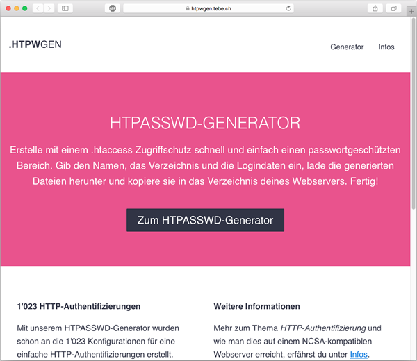

# HTPASSWD Generator

HTPASSWD Generator is a simple demo project using Vue.js and Pure.css. The aim of this project is to lern Vue.js and play around with its features. So, the project itself is quite senseless.



## Build Setup

``` bash
# install dependencies
npm install

# serve with hot reload at localhost:8080
npm run dev

# build for production with minification
npm run build
```

For more information see the [docs for vueify](https://github.com/vuejs/vueify).


## Vue.js Template

https://github.com/vuejs-templates/browserify
